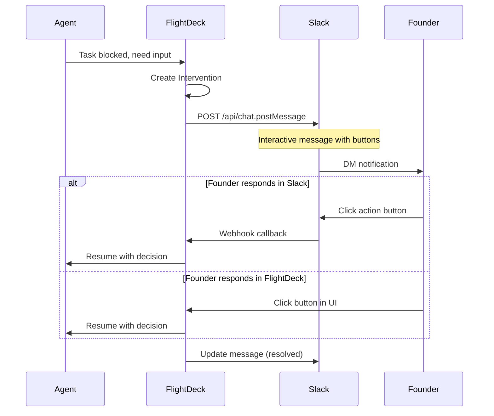

# FlightDeck User Flows

## Overview
FlightDeck is a command center for solo founders managing multiple AI-powered startups. This document maps the complete user journey from onboarding a new startup through monitoring and intervention handling.

---

## 1. Startup Onboarding Flow

```mermaid
flowchart TD
    A[Founder clicks "Add Startup"] --> B[Enter Startup Details]
    B --> C{Startup Stage?}
    C -->|Idea| D[Assign Research Agent]
    C -->|Plan| E[Assign Research + Content Agents]
    C -->|Design| F[Assign Design + Dev Agents]
    C -->|Build| G[Assign Dev + Design + Content Agents]
    C -->|Test| H[Assign Dev + Analytics Agents]
    C -->|Launch| I[Assign All Agents]
    C -->|Grow| J[Assign Analytics + Email + Content]
    C -->|Scale| K[Assign Full Agent Suite]

    D --> L[Connect Integrations]
    E --> L
    F --> L
    G --> L
    H --> L
    I --> L
    J --> L
    K --> L

    L --> M{Which integrations?}
    M -->|Slack| N[OAuth Connect Slack]
    M -->|Stripe| O[Connect Stripe API]
    M -->|GitHub| P[Connect GitHub Repo]
    M -->|Email| Q[Connect Email Provider]

    N --> R[Set Notification Preferences]
    O --> R
    P --> R
    Q --> R

    R --> S[Agents Begin Working]
    S --> T[Startup Added to Live Ops Dashboard]
```

### Onboarding Steps Detail

| Step | Action | Data Captured |
|------|--------|---------------|
| 1. Create Startup | Name, tagline, stage | `name`, `tagline`, `stage`, `color` |
| 2. Select Stage | Choose from: idea, plan, design, build, test, launch, grow, scale | `stage` |
| 3. Auto-assign Agents | Based on stage, agents are pre-selected | `assigned_agents[]` |
| 4. Connect Integrations | OAuth flows for Slack, Stripe, GitHub, etc. | `integrations{}` |
| 5. Set Preferences | Notification frequency, approval thresholds | `preferences{}` |
| 6. Agents Activate | Agents begin initial tasks | `tasks[]` created |

---

## 2. Agent Monitoring Flow

```mermaid
flowchart TD
    A[Agents Working] --> B{Task Completed?}
    B -->|Yes| C[Log to Activity Feed]
    B -->|No| D{Blocked?}

    D -->|No| A
    D -->|Yes| E{Blocker Type?}

    E -->|Need Approval| F[Create APPROVAL Intervention]
    E -->|Need Decision| G[Create DECISION Intervention]
    E -->|Need Review| H[Create REVIEW Intervention]
    E -->|Need Clarification| I[Create CLARIFICATION Intervention]
    E -->|Error Occurred| J[Create ERROR Intervention]

    F --> K[Send Slack Notification]
    G --> K
    H --> K
    I --> K
    J --> K

    K --> L[Add to "Needs Your Input" Panel]
    L --> M{Founder Responds?}

    M -->|Yes, in FlightDeck| N[Resolve Intervention]
    M -->|Yes, via Slack| N
    M -->|No Response| O{Timeout?}

    O -->|< 1 hour| M
    O -->|1-4 hours| P[Send Reminder]
    O -->|> 4 hours| Q[Escalate / Pause Task]

    P --> M
    N --> R[Agent Continues Work]
    R --> A
```

---

## 3. Intervention Trigger Logic

### When "Needs Your Input" is Created

| Trigger | Intervention Type | Urgency | Example |
|---------|-------------------|---------|---------|
| Financial change > $10/mo | `approval` | HIGH | "Dev Agent wants to change pricing tier" |
| A/B test results ready | `decision` | MEDIUM | "Content found LinkedIn 3x better than Twitter" |
| Document ready for publish | `review` | MEDIUM | "Terms of Service draft ready" |
| Missing context/data | `clarification` | LOW | "Need brand voice guidelines" |
| API error / integration fail | `error` | HIGH | "Stripe webhook failed" |
| Code ready for production | `approval` | HIGH | "Ready to deploy to production" |
| Budget threshold reached | `approval` | HIGH | "Monthly spend approaching $500 limit" |

### Slack Notification Flow



---

## 4. Startup Stages & Agent Assignments

### Stage: IDEA
**Goal:** Validate the concept before investing time

| Agent | Tasks |
|-------|-------|
| Research Agent | Market research, competitor analysis, TAM/SAM/SOM |

**Interventions:**
- `decision`: "Research found 5 competitors. Continue or pivot?"
- `review`: "Market analysis report ready"

---

### Stage: PLAN
**Goal:** Define MVP scope and roadmap

| Agent | Tasks |
|-------|-------|
| Research Agent | Feature prioritization, user persona research |
| Content Agent | Write PRD, create user stories |

**Interventions:**
- `review`: "PRD draft ready for review"
- `decision`: "Prioritize feature A or B for MVP?"

---

### Stage: DESIGN
**Goal:** Create visual identity and UX

| Agent | Tasks |
|-------|-------|
| Design Agent | Logo, brand colors, UI mockups |
| Dev Agent | Set up project structure, design system |

**Interventions:**
- `review`: "3 logo options ready for selection"
- `approval`: "Final brand guidelines ready to lock"

---

### Stage: BUILD
**Goal:** Develop the MVP

| Agent | Tasks |
|-------|-------|
| Dev Agent | Code features, integrate APIs, deploy |
| Design Agent | Asset generation, responsive designs |
| Content Agent | Copywriting, help text, onboarding content |

**Interventions:**
- `approval`: "Ready to deploy feature X to staging"
- `error`: "GitHub Actions build failed"
- `clarification`: "Need Stripe API keys to continue"
- `decision`: "Use Supabase or Firebase for auth?"

---

### Stage: TEST
**Goal:** QA and user testing

| Agent | Tasks |
|-------|-------|
| Dev Agent | Bug fixes, performance optimization |
| Analytics Agent | Set up tracking, create dashboards |

**Interventions:**
- `review`: "5 bugs found, prioritize fixes"
- `approval`: "Ready for beta launch"

---

### Stage: LAUNCH
**Goal:** Go live and acquire first users

| Agent | Tasks |
|-------|-------|
| All Agents | Full support for launch activities |
| Dev Agent | Production deploy, monitoring |
| Email Agent | Welcome sequences, launch announcements |
| Content Agent | Blog posts, social content |

**Interventions:**
- `approval`: "Deploy to production?"
- `decision`: "Soft launch or public launch?"
- `error`: "High error rate detected post-launch"

---

### Stage: GROW
**Goal:** Acquire and retain customers

| Agent | Tasks |
|-------|-------|
| Analytics Agent | Conversion optimization, cohort analysis |
| Email Agent | Drip campaigns, re-engagement |
| Content Agent | SEO, content marketing |

**Interventions:**
- `decision`: "Double down on LinkedIn content?"
- `approval`: "Increase ad spend to $X/day?"

---

### Stage: SCALE
**Goal:** Optimize for profitability and expansion

| Agent | Tasks |
|-------|-------|
| Full Suite | All agents at full capacity |
| Research Agent | New market opportunities |
| Dev Agent | Infrastructure scaling |

**Interventions:**
- `approval`: "Hire contractor for $X?"
- `decision`: "Expand to new market segment?"

---

## 5. The 10 Startups in FlightDeck

| # | Name | Tagline | Stage | Primary Agents |
|---|------|---------|-------|----------------|
| 1 | Co-elevator | AI-powered pitch decks | Launch | Dev, Email, Content |
| 2 | Parama.ai | Parameter tuning assistant | Grow | Analytics, Content |
| 3 | IndiVillage | Marketplace for rural artisans | Launch | Dev, Email, Content |
| 4 | Karma Street Wear | Ethical streetwear brand | Build | Dev, Design, Content |
| 5 | SlideArabi | Arabic presentation builder | Launch | Dev, Content |
| 6 | StockClerk.ai | Inventory management AI | Build | Dev, Design, Analytics |
| 7 | LeadPulse | Real-time lead scoring | Idea | Research |
| 8 | InvoiceFlow | Smart invoicing platform | Grow | Analytics, Email |
| 9 | DataNest | Data warehouse for startups | Scale | Dev, Analytics, Research |
| 10 | MealMind | AI meal planning for families | Plan | Research, Content |

---

## 6. Notification Preferences

Founders can configure when and how they receive Slack notifications:

| Setting | Options | Default |
|---------|---------|---------|
| Notification Channel | DM, Channel, Both | DM |
| Urgency Filter | All, High Only, None | All |
| Quiet Hours | Time range | 10pm - 7am |
| Reminder Frequency | 30min, 1hr, 4hr | 1hr |
| Auto-approve Threshold | $ amount | $0 (all need approval) |

---

## 7. Activity Feed Event Types

| Type | Icon | Color | Trigger |
|------|------|-------|---------|
| `success` | Checkmark | Green | Task completed successfully |
| `info` | Lightning | Gray | Task started or in progress |
| `warning` | Alert | Amber | Attention needed soon |
| `error` | Alert | Red | Task failed, needs intervention |

---

## Next Steps

1. [ ] Implement onboarding wizard UI
2. [ ] Build Slack integration OAuth flow
3. [ ] Create intervention resolution API
4. [ ] Add notification preferences settings page
5. [ ] Implement reminder/escalation system
